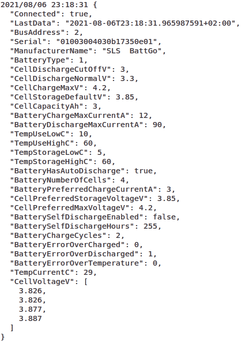
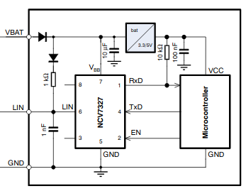
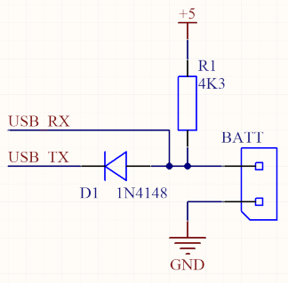

# Golang BattGO Libraty

## Functionality
This library allows interfacing, as a controller, to a [BattGO](http://www.battgo.org/) comaptible network. This allows reading the telemetry and changing the configuration from one or more batteries.

## How to use
A simple example program is provided in the toplevel of the repository (main.go). It will output the data of all attached batteries to the console.

Typical output is as follows:  

## Hardware interface
Please note that this library does not use the BattGO Linker, it interfaces directly to the bus using any UART. This is more convenient for embedded applications. 

The easiest way to interface to the data wire is to use a LIN transceiver chip. This chip will include all protections needed to ensure robustness in a BMS application. Please note that you need to use a LIN transceiver without TX timeout to send long breaks on the line. A good device is the [NCV7327D10R2G](https://eu.mouser.com/datasheet/2/308/1/NCV7327_D-2317507.pdf). 

You can use the schematic as described in the datasheet of that device:  

Of course, any interface that combines TX and RX in a non-inverting way will work. It seems to get a good response from the battery you need to have at least 5V signal levels. The battery has a weak drive level.

For experimentation you can simply use a 5V USB-to-TTL converter and connect TX and RX together, please see the next section.

## Unsafe simple interface
This section explains how to make a very simple interface using a USB-to-TTL adapter. Note that a real system will require a protection circuit on the data line as otherwise the device is likely to be damaged on hot plugging. When using this interface, always connect the ground first.

We start from a standard [CH340 dongle](https://aliexpress.com/item/1005002119244700.html) found on AliExpress. This dongle has TX and RX leds that load the IO lines, as well as a series resistor. This will likely give communication issues as the drive strength of the battery is weak. Please unsolder the LEDs and bridge the resistor as shown in the bottom half of following figure (red circle shows the area to modify):  

The top half of the previous figure shows the small circuit to connect TX and RX together. The schematic is shown in the next figure:

Make sure to set the jumper on the dongle to 5V and connect your XT60i connector to the RX and GND pins.

